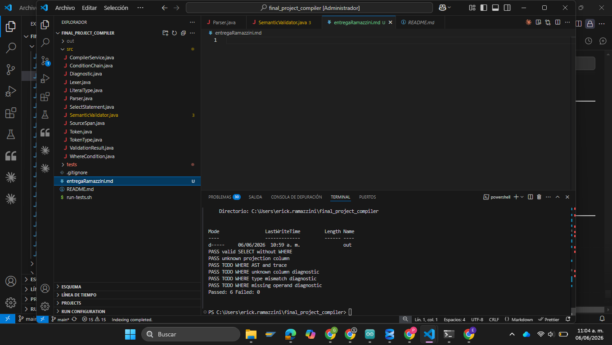

# Reporte de Entrega — Compilador Final
**Autor:** Erick Ramazzini  
**Fecha:** 2026-06-06  
**Repositorio:** `final_project_compiler`

---

## Descripción del Proyecto

Mini-compilador de consultas `SELECT` con soporte de cláusula `WHERE`. El pipeline consta de tres etapas: **Lexer → Parser → SemanticValidator**, procesando sentencias SQL simplificadas y emitiendo diagnósticos sintácticos y semánticos, además de trazas de validación de tipos.

---

## Imagen de Referencia



---

## Historial de Commits

| Hash | Fecha | Descripción |
|------|-------|-------------|
| `f0acba5` | 2026-06-05 | `feat: add final compiler base project` |
| `2dadbcc` | 2026-06-06 | `feat: implement WHERE clause` |

---

## Cambios Implementados

### Commit `2dadbcc` — Implementación de la cláusula WHERE

**Archivos modificados:** `src/Parser.java`, `src/SemanticValidator.java`  
**Líneas agregadas:** +81 | **Líneas eliminadas:** -7

---

### `src/Parser.java` — Parseo de condiciones WHERE

**Antes:** Al encontrar el token `WHERE`, el parser emitía un diagnóstico de error `SYNTACTIC_EXPECTED_WHERE_OPERAND` ("Soporte WHERE pendiente") y consumía todos los tokens hasta `EOF` o `;` sin construir ningún AST.

**Después:** Se implementó el parseo completo de la cláusula `WHERE` con soporte para múltiples condiciones encadenadas por `AND` / `OR`.

#### Métodos agregados:

| Método | Responsabilidad |
|--------|----------------|
| `parseWhereCondition(ConditionChain)` | Parsea una condición individual: `<columna> <operador> <literal>` y la agrega a la cadena. |
| `expectOperator()` | Valida y consume tokens de operadores relacionales (`=`, `>`, `<`, `>=`, `<=`, `<>`). Emite diagnóstico `SYNTATIC_EXPECTED_WHERE_OPERAND` si no encuentra un operador válido. |
| `expectLiteral()` | Valida y consume tokens literales (`NUMBER`, `STRING`, `TRUE`, `FALSE`). Emite diagnóstico `SYNTACTIC_EXPECTED_WHERE_OPERAND` si el token no es un literal. |
| `classifyLiteral(Token)` | Clasifica un token literal en `LiteralType.NUMBER`, `LiteralType.STRING` o `LiteralType.BOOLEAN`. |

#### Flujo del parseo WHERE (código nuevo):

```java
if (match(TokenType.WHERE)) {
    ConditionChain chain = new ConditionChain();
    parseWhereCondition(chain);
    while (check(TokenType.AND) || check(TokenType.OR)) {
        String connector = current().lexeme.toUpperCase();
        advance();
        chain.connectors.add(connector);
        parseWhereCondition(chain);
    }
    statement.where = chain;
}
```

---

### `src/SemanticValidator.java` — Validación semántica de condiciones WHERE

**Antes:** La sección de validación WHERE estaba vacía (solo comentarios de TODOs).

**Después:** Se implementó la validación completa recorriendo todas las condiciones de `ast.where`.

#### Lógica implementada:

1. **Columna desconocida** — Si la columna del `WHERE` no existe en la tabla de símbolos, emite:
   ```
   Diagnostic("SEMANTIC_UNKNOWN_WHERE_COLUMN", ...)
   ```

2. **Traza de verificación de tipo** — Si la columna existe, emite una traza con el formato:
   ```
   TRACE|WHERE_TYPE_CHECK|<línea>:<columna>|<nombreColumna>|<operador>|<tipoLiteral>
   ```

3. **Incompatibilidad de tipos** — Si el tipo del literal no coincide con el tipo declarado de la columna, emite:
   ```
   Diagnostic("SEMANTIC_TYPE_MISMATCH", ...)
   ```

#### Código agregado:

```java
if (ast.where != null) {
    for (int i = 0; i < ast.where.conditions.size(); i++) {
        WhereCondition cond = ast.where.conditions.get(i);
        String colName = cond.column.toLowerCase();
        if (!table.containsKey(colName)) {
            result.diagnostics.add(new Diagnostic("SEMANTIC_UNKNOWN_WHERE_COLUMN",
                "Columna WHERE verifique c no existe: " + cond.column, cond.columnSpan));
        } else {
            result.traces.add("TRACE|WHERE_TYPE_CHECK|" + cond.columnSpan.format() +
                "|" + cond.column + "|" + cond.operator + "|" + cond.literalType);
            if (table.get(colName) != cond.literalType) {
                result.diagnostics.add(new Diagnostic("SEMANTIC_TYPE_MISMATCH",
                    "dato incorrecto: " + cond.column, cond.literalSpan));
            }
        }
    }
}
```

---

## Resumen de Diagnósticos Soportados

| Código | Etapa | Cuándo se emite |
|--------|-------|-----------------|
| `SYNTATIC_EXPECTED_WHERE_OPERAND` | Sintáctico | Token en posición de operador no es relacional |
| `SYNTACTIC_EXPECTED_WHERE_OPERAND` | Sintáctico | Token en posición de literal no es un valor |
| `SEMANTIC_UNKNOWN_WHERE_COLUMN` | Semántico | La columna del WHERE no está en la tabla |
| `SEMANTIC_TYPE_MISMATCH` | Semántico | El tipo del literal no coincide con la columna |

---

## Estructura del Proyecto

```
final_project_compiler/
├── src/
│   ├── CompilerService.java     # Orquesta el pipeline completo
│   ├── ConditionChain.java      # AST: cadena de condiciones WHERE
│   ├── Diagnostic.java          # Modelo de error/advertencia
│   ├── Lexer.java               # Análisis léxico
│   ├── LiteralType.java         # Enum de tipos literales
│   ├── Parser.java              # Análisis sintáctico ← MODIFICADO
│   ├── SemanticValidator.java   # Validación semántica ← MODIFICADO
│   ├── SelectStatement.java     # AST: sentencia SELECT
│   ├── SourceSpan.java          # Rango de posición en fuente
│   ├── Token.java               # Modelo de token
│   ├── TokenType.java           # Enum de tipos de token
│   ├── ValidationResult.java    # Resultado del compilador
│   └── WhereCondition.java      # AST: condición individual WHERE
└── tests/
    └── TestRunner.java          # Suite de pruebas
```
